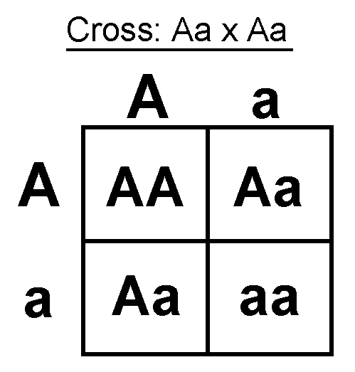

# Biologia 1

## Cap. 8

Animais sem Sistema Circulatório - Não está presente em Poríferos, Cnidários, Platelmintos e Nematelmintos, com a troca de substâncias ocorrendo direto com o meio por difusão, por seus tecidos terem poucas camadas

Sistema Circulatório - Sistema responsável pela distribuição de substâncias (gases, nutrientes, excretas, hormônios) pelo corpo

---

Tipos de Circulação

- Aberta (ou Lacunosa) - A hemolinfa sai do interior dos vasos e banha as células. Presente em artrópodes e moluscos não-cefalópodes
  
  - Hemolinfa - Líquido que circula

- Fechada

---

Circulação Fechada - O sangue sempre fica dentro dos vasos. Presente nos anelídeos, cefalópodes e vertebrados

- Circulação Simples - O sangue passa pelo coração apenas uma vez por ciclo. Encontrado nos peixes (coração -> brânquias -> tecidos -> coração)

- Circulação Dupla - O sangue passa duas vezes pelo coração a cada ciclo. Encontrado nos tetrápodes
  
  - Circulação Pulmonar (ou Pequena Circulação) - O sangue vai do coração para os pulmões e depois volta para o coração
  
  - Circulação Sistêmica (ou Grande Circulação) - O sangue vai do coração (depois da circulação pulmonar) para os tecidos e depois volta para o coração
  
  - Tipos
    
    - Incompleta (ou com Mistura) - Há a mistura de sangue venoso e arterial. Ocorre nos anfíbios e répteis
    
    - Completa (ou sem Mistura) - Não há a mistura. Ocorre nas aves e mamíferos

---

Vasos Sanguíneos

- Artérias - Vasos que saem do coração. São mais grossos, por ter maior pressão e são mais profundos
  
  - Arteríolas - Artérias ramificadas

- Veias - Vasos que chegam no coração. Possuem parede menos grossa que as artérias, e pressão menor. Possuem válvulas
  
  - Válvulas - Estruturas nas veias que contribuem para o retorno venoso, por evitar a volta do sangue para o corpo, garantindo fluxo unidirecional. O retorno também é auxiliado pelos músculos, sobretudo da perna
  
  - Vênulas - Veias ramificadas

- Capilares - Vasos com camada de apenas uma célula (chamada de endotélio), por onde ocorre a troca de substâncias, além de conectar as arteríolas com as vênulas
  
  - Troca de Substâncias - Ocorre entre o sangue e as células por meio de difusão, sendo facilitada pela pressão arterial e osmótica
  
  - Líquido Intersticial - Líquido que temporariamente sai dos capilares e toca nas células
    
    - Vasos Linfáticos - Devolvem o líquido intersticial (chamado agora de linfa) para o sangue por uma veia. Formam o sistema linfático
      
      - Linfonodos - Estruturas presentes nos vasos com leucócitos

---

Coração - Responsável pelo bombeamento do sangue pelos vasos

- Câmaras Cardíacas
  
  - Átrios (ou Aurículas) - Câmaras cardíacas por onde o sangue entra pelas veias
  
  - Ventrículos - Câmaras cardíacas por onde o sangue sai pelas artérias

- Valvas - Valvas que abrem e fecham para impedir a volta de sangue. Causam o som das batidas do coração
  
  - Atrioventricular Esquerda (ou Bicúspide ou Mitral) - Separa o átrio esquerdo e ventrículo esquerdo
  
  - Atrioventricular Direita (ou Tricúspide) - Separa o átrio direito e ventrículo direito
  
  - Semilunar (ou do Tronco Aórtico) - Fica entre o ventrículo direito e a artéria aorta
  
  - Valva Pulmonar - Fica entre o ventrículo esquerdo e a artéria pulmonar

- Miocárdio - Musculatura do coração, responsável pelo bombeamento. Sua contração se chama de sístole e seu relaxamento, diástole
  
  - Artérias Coronárias - Artérias que transportam sangue para o miocárdio
  
  - Sístole - Movimento de contração, podendo ser tanto do átrio (atrial) quando do ventrículo (ventricular), permitindo a saída de sangue dessa câmara
  
  - Diástole - Movimento de relaxamento, permitindo a entrada do sangue na câmara cardíaca

- Nós - Responsáveis por geral os estímulos nervosos do coração
  
  - Nó Sinoatrial (SA) - Fica na parede do átrio direito, passando pelos dois átrios
  
  - Nó Atrioventricular (AV) - Fica na parte de baixo do ventrículo, recebendo o estímulo do sinoatrial e subindo pelo fascículo atrial (ou feixe de Hess) e pelos ramos subendocárdicos (ou fibras de Purkinje)
  
  - Frequência Cardíaca - Frequência em que ocorre a contração do coração

- Tipos
  
  - Bicavitário - Possui um átrio e um ventrículo. Presente nos peixes
    
    - Fluxo - Átrio -> ventrículo -> artéria aorta -> brânquias -> artéria aorta -> tecidos -> veia cava -> átrio
  
  - Tricavitário - Possui dois átrios, mas apenas um ventrículo. Presente nos anfíbios e répteis não crocodilianos
    
    - Átrio Direito - Recebe o sangue pobre pela veia cava
    
    - Átrio Esquerdo - Recebe o sangue rico pela veia pulmonar
    
    - Ventrículo - Recebe o sangue dos dois átrios, misturando-os e mandando para o pulmão (artéria pulmonar) e corpo (artéria aorta)
      
      - Septo Incompleto (ou Septo de Sabatier) - Septo nos répteis que dificulta a mistura, mas não barra-a completamente
  
  - Tetracavitário - Possui dois átrios e dois ventrículos. Presente nos crocodilianos, aves e mamíferos
    
    - Câmaras Direitas - Veia cava -> átrio direito -> ventrículo direito -> artéria pulmonar. Recebem sangue pobre
    
    - Câmaras Esquerdas - Veia pulmonar -> átrio esquerdo -> ventrículo esquerdo -> artéria aorta. Recebem sangue rico
      
      - Artéria Aorta - Nas aves, curva para o lado direito, e nos mamíferos, para o esquerdo
    
    - Forame de Panizza - Septo que quase impede a mistura de sangue nos átrios, mas ainda mistura pouco. Encontrado nos crocodilianos
    
    - Septo Interventricular - Septo que separa completamente os ventrículos. Nas aves e mamíferos

---

Doenças Cardiovasculares - Doenças relacionadas ao sistema cardiovascular

- Aneurisma - Doença em que há a formação de uma bolsa externa ao vaso, pelo enfraquecimento da parede. Caso rompida, pode causar hemorragia, AVC e morte

- Varizes - Causadas pelo mal funcionamento das válvulas das veias

- Infarto - Causado pelo entupimento das artérias coronárias, causando a parada cardíaca

---

Sangue - Tecido conjuntivo formado pelo plasma e elementos figurados

- Tipos
  
  - Sangue Venoso - Sangue rico em CO2 e pobre em O2
  
  - Sangue Arterial - Sangue rico em O2 e pobre em CO2

- Plasma - Matriz extracelular do sangue, composta por água com nutrientes, gases, excretas, hormônios e anticorpos

- Elementos Figurados - São as células sanguíneas
  
  - Medula Óssea - Origina os elementos figurados, pelas células-tronco hematopoiéticas
    
    - Hematopoiese - Processo de produção dos elementos figurados
  
  - Hemácias (ou Eritrócitos) - Células com função de transportar oxigênio, pela proteína hemoglobina. Podem também transportar CO2, mas esse é mais transportado na forma de bicarbonato (HCO3-) no plasma
    
    - Eritroblastos - Hemácias jovens, que ainda possuem núcleo, para produzir hemoglobina. Quando fica adulta, perde o núcleo e organelas
    
    - Eritropoetina - Estimula a produção de hemácias, como em locais onde o ar é rarefeito
    
    - Anemia - Falta de hemácias no sangue
  
  - Plaquetas (ou Trombócitos) - Fragmentos de células chamadas de megacariócitos, responsáveis pela coagulação do sangue
    
    - Coagulação - Processo de reparação de um vaso sanguíneo rompido
      - Cascata de Coagulação - Há a acumulação de plaquetas que liberam a tromboplastina, que transforma a protrombina em trombina, essa transformando o fibrinogênio em fibrina, que forma uma rede que prende as hemácias e forma o coágulo
  
  - Leucócitos (ou Glóbulos Brancos) - Células responsáveis pela defesa do organismo, formando o sistema imune
    
    - Macrófagos - Tipos de leucócitos que vão para os tecidos e fagocitam partículas e microorganismos indesejados
      - Neutrófilo - Fagocita células estranhas e liberam substâncias que destroem bactérias
      - Eosinófilo - Combate os efeitos da reação alérgica
      - Basófilo - Libera histamina e heparina nas reações alérgicas, causando vermelhidão e coceira
    - Linfócitos - Tipos de leucócitos que produzem as proteínas de anticorpos
      - Linfócito B - Produz os anticorpos
      - Linfócitos TCD4 - Recebem os antígenos fagocitados e estimulam os linfócitos B

## Cap. 9 [NÃO FEITO]

## Cap. 10 [NÃO FEITO]

## Cap. 11 [NÃO FEITO]

## Cap. 12 [NÃO FEITO]

# Biologia 2

## Cap. 6

Biotecnologia - Uso de seres vivos ou seus derivados para fabricar ou modificar produtos ou processos. Ex: fermentação, cruzamento de espécies, vacinas, clonagem, diagnósticos, biocombustíveis

- Engenharia Genética - Manipulação do DNA de seres vivos
  
  - Organismos Geneticamente Modificados (OGMs) - Ser que teve seu material genético alterado
    
    - Transgênicos - OGMs que receberam genes de outra espécie
    
    - Silenciamento Gênico - Um gene do ser é inativado
  
  - DNA Recombinante - Técnica em que fitas de DNA são cortadas e unidas pelo DNA ligase, normalmente feito com um plasmídeo e um DNA de outro ser, que pode ser introduzido em outro ser, usado para produzir uma enzima como insulina ou para criar cópias do DNA unido
    
    - Enzimas de Restrição (ou Endonuclease de Restrição) - Enzimas que cortam o DNA em sequências de nucleotídeos específicos (sítios de restrição)
    
    - Gene Artificial - Uma fita de RNA é sintetizada em laboratório com um gene artificial, sendo transformado em DNA pela proteína transcriptase reversa
  
  - Vetores Virais - Modificação do DNA de um vírus para um de interesse, para quando o vírus infectar células esse material genético é introduzido
    
    - Terapia Gênica - Genes defeituosos são corrigidos e introduzidos no ser por vetores virais
    
    - Terapia CART - Linfócitos T são modificados por vetores virais para expressar o receptor CAR que reconhece algumas células cancerígenas
    
    - Células-Tronco Pluripotentes Induzidas (iPS) - Células somáticas voltam a ser pluripotentes por vetores virais
  
  - CRISPR - Técnica de edição do DNA de forma específica. Utiliza a enzima Cas9 e o RNA guia para cortar partes específicas do DNA, direcionadas pela ligação do RNA CRISPR ao DNA
  
  - Biobalística - Partículas pequenas de metal pesado são revestidas de DNA e atiradas a alta velocidade nas células, chegando ao núcleo da célula
  
  - RNA de Interferência - Um RNA complementar a um RNAm é introduzido, levando ao pareamento e a interrupção da formação da proteína do RNAm

- Eletroforese - Técnica em que fitas de DNA são colocadas em um gel poroso, separando-os por tamanho por meio de um campo elétrico
  
  - DNA Fingerprint (ou Identificação por DNA) - Técnica de diferenciação de indivíduos pelo DNA, comparando bandas de DNA formadas na eletroforese por meio da divisão do DNA pelas regiões intergênicas, regiões entre genes funcionais em que há a repetição de sequência de nucleotídeo

- Células-Tronco - Células indiferenciadas, podendo se diferenciar em qualquer tipo de célula, por meio da expressão de genes específicos de DNA
  
  - Totipotentes - Células-tronco que se diferenciam em qualquer célula, inclusive anexos embrionários. Encontrado na mórula
  
  - Pluripotentes - Células-tronco que se diferenciam em qualquer célula, menos os anexos embrionários. Encontrado na blástula
  
  - Multipotentes - Células-tronco que se diferenciam em células de mesma origem embrionária do tecido. Encontrado na medula óssea (células sanguíneas)
  
  - Unipotentes - Células-tronco que se diferenciam em células do mesmo tecido. Encontrado nos tecidos

- Clonagem Reprodutiva - Produção de um indivíduo geneticamente igual a outro. O núcleo de uma célula somática do indivíduo clonado é colocada em um óvulo cujo núcleo foi retirado

- Clonagem Terapêutica - Técnica de tratamento de doenças degenerativas, genéticas e para transplantes, onde é formado um óvulo da mesma forma que na clonagem reprodutiva, mas as células pluripotentes do embrião são retiradas, para ser usada sua capacidade regenerativa

- Proteína C-Reativa (PCR) - Técnica de multiplicação de DNA, pela desnaturação (quebra) e anelamento (preenchimento dos fragmentos)

- Sequenciamento do Genoma - Processo de determinação da sequência de bases do DNA

## Cap. 7

Pré-Formismo - Crença antiga de que os seres já eram pré-formados nos gametas

Genética - Estuda a hereditariedade

- Hereditariedade - Transmissão de características de um indivíduo para filhos. Depende dos genes, transferidos pelos gametas

- 1a Lei de Mendel (ou Lei da Segregação Independente) - Diz que características de um ser são determinadas por genes no material genético, que é um par de alelos
  
  - Gregor Mendel - Responsável por criar as bases para a genética, pelos seus experimentos com características de ervilhas *Pisum sativum*, por ter ciclo de vida curto, várias sementes, autofecundação e características simples, como cor e forma da flor, semente e vagem
  
  - Alelo - Forma o gene, com um vindo do pai e outro da mãe, pela separação dos alelos deles na meiose I. Representado por A ou a
  
  - Gene - Determina uma característica em um ser, sendo representado por AA, Aa ou aa
    
    - Genoma - Conjunto de genes de um ser
  
  - Dominância - Quando uma característica precisa de apenas um alelo para se manifestar. Representado por AA ou Aa
  
  - Recessividade - Quando uma característica precisa dos dois alelos para se manifestar. Representando por aa
  
  - Homozigose (ou Pureza) - Quando o par de alelos é igual. Pode ser dominante (AA) ou recessivo (aa)
  
  - Heterozigose (ou Hibridez) - Quando o par de alelos é diferente, sendo dominante (Aa)
  
  - Genótipo - Conjunto de alelos de um ser, sendo imutável
  
  - Fenótipo - Características expressas pelo genótipo, mas que podem ser influenciadas por outros fatores

- Cruzamento-Teste - Utilizado para determinar os alelos de um gene dominante em um ser, por poder ser AA ou Aa. É feito pelo cruzamento deste com um recessivo (aa). Caso seja AA, formará apenas dominantes (Aa), mas se for Aa, pode formar recessivos (aa)

- Diagrama de Punnett - Representação do cruzamento de indivíduos para analisar os genótipos e fenótipos formados
  
  - Diagrama de Punnett para dois heterozigotos (Aa)

## Cap. 8

Proporção Fenotípica - Proporção entre fenótipos formados em um cruzamento. Ex: Aa x Aa: AA, Aa, Aa, aa (proporção 3:1)

Proporção Genotípica - Proporção entre genótipos formados em um cruzamento. Ex: Aa x Aa: AA, Aa, Aa, aa (proporção 1:2:1)

---

Herança Dicotômica (ou Mendeliana) - Há um alelo dominante em relação ao outro, em que o homozigoto dominante (AA) e o heterozigoto (Aa) tem o mesmo fenótipo

Dominância Incompleta (ou Herança sem Dominância) - O heterozigoto é um fenótipo intermediário, sendo diferente dos dois homozigotos, pois os dois alelos se manifestam. Nela, o genótipo e fenótipo são iguais

- Herança Intermediária - O fenótipo do heterozigoto é um meio termo entre o dos homozigotos. Ex: flor vermelha (VV), flor branca (BB) e flor rosa (VB)

- Codominância - O fenótipo dos dois alelos ficam aparentes, mas não misturados. Ex: gado vermelho (VV), gado branco (BB) e gado malhado (branco e vermelho, VB)
  
  - Ruão - Pelagem com mais de uma cor, podendo ser causada pela codominância

---

Alelos Letais - Quando um dos alelos em homozigose causa a morte do ser. Nela, os seres que morrem não participam da proporção fenotípica e genotípica. Ex: camundongo amarelo (Aa), camundongo aguti (aa), gene letal (AA)

---

Expressão Gênica - Como o gene é traduzido em moléculas, que resultam no fenótipo. Não dependem apenas do gene em si, mas também de fatores como outros genes e fatores ambientais

- Pleiotropia - Ocorre quando um único gene é responsável por mais de uma característica
  
  - Síndrome de Marfan - Doença autossômica dominante com pleiotropia, causada pela mutação de um gene específico, resultando na não produção de fibrilina, causando estatura alta, dedos longos, depressão no tórax e problemas na artéria aorta

Expressividade Gênica - É o modo e intensidade que um gene se manifesta, que pode variar (expressividade variável)

- Polidactilia - Doença autossômica dominante com expressividade variável, que tem como consequência a formação de dedos a mais, podendo ocorrer nas mãos, pés ou ambos

Penetrância - Proporção de pessoas com um genótipos que possuem o fenótipo esperado. Pode ser completa (sempre tem fenótipo) ou incompleta

---

Epigenética - Estuda as mudanças de fenótipo que não são causadas pela alteração do DNA, e sim por outros fatores (estresse, deficiência nutricional, agente poluente...)

- Metilação - Fenômeno causado pelos fatores anteriores em que há a inserção do grupo metil ao DNA, interferindo nas regiões de genes promovidos

## Cap. 9 [NÃO FEITO]

## Cap. 10 [NÃO FEITO]

# Educação Física

## Danças e Lutas [INACABADO]

Lutas Modernas

- Karatê - Arte marcial japonesa com foco em golpes de impacto e defesa com foco nas mãos e pés

- Taekwondo - Arte marcial coreana focada em chutes altos e rápidos, com uso de protetores

- Muay Thai - Arte marcial tailandesa com foco nos punhos, cotovelos, joelhos e canelas

- Judô - Arte marcial japonesa com objetivo de desequilíbrio e imobilização, sendo luta de chão

- Sumô - Japonesa, com objetivo de desequilibrar ou empurrar o outro para fora de um círculo, com empurrões e agarrões

- Mixed Martial Arts (MMA) - Luta que mistura técnicas de diversas artes marciais, com regras mais amplas

- Kickboxing - Mistura socos do boxe com técnicas de chute

- Boxe - Usa apenas os punhos para defesa e ataque, ocorrendo em um ringue quadrado

# Filosofia [ASSUNTO NÃO SAIU]

## Cap. 5

Friedrich Nietzsche - Conhecido como "filósofo do martelo", sendo considerado a transição entre filosofia moderna e contemporânea

- Verdade - Ele era contra a verdade absoluta, primordial, dizendo que é uma ilusão
  
  - Razão - Também era contra, bem como a moral, por serem fontes da verdade. Defende que, junto com a verdade e Deus, foram criados pelo homem por medo
  
  - Religião - Era contra como a razão, por ser um conjunto de leis morais consideradas absolutas, sobretudo sendo contra o cristianismo
    
    - Paulo de Tarso - Criticado por Nietzsche, por criar os dogmas
    
    - Dogmas - Conjunto de leis morais consideradas absolutas
      
      - Moral de Escravo (ou Moral de Rebanho) - Defende que os dogmas são usados como meio de dominação, submetendo o homem a uma moral
  
  - Busca pela Verdade - Considera que afastou a filosofia de sua verdadeira finalidade, que deve ser o agora, a vida, que é manifestada pela vontade, prazer e gosto, e é muitas vezes negada por ela. Por isso, critica filósofos como Sócrates e Platão
    
    - Niilismo - Negação da vida. Ex: cristianismo (nega a vida por uma recompensa após a morte)
    
    - Sócrates - Comparado a Jesus, por ambos serem mártires valorizados pelas suas humildades, trajetórias de vida e por serem injustiçados. Para ele, o problema é que guiam para um futuro não confirmado (verdade absoluta e vida após a morte)
  
  - "Deus está morto" - Manifesta a necessidade do fim da moral cristã, além da razão, que substituiu Deus após o iluminismo, ambos metafísicos

- Dualidade - Defende a necessidade de união entre a razão (filosofia) e emoção (arte), formando uma nova totalidade
  
  - Apolo - Divindade da clareza e harmonia, utilizado como metáfora para a razão, pensamento racional. Defende que Apolo foi herdado na filosofia ocidental desde os gregos
  - Dionísio - Divindade do vinho, festa, utilizado como metáfora para a emoção, excesso e paixão, ainda presente nas artes

- Transvaloração de Valores - A destruição de todos os valores já estabelecidos para haver o surgimento de novos valores
  
  - Vontade de Potência - Vontade que é uma força afirmadora da vida, crucial para a transvaloração. É fortalecida pela emoção, paixão, arte, entretenimento e enfraquecida pela moral cristã, trabalho repetitivo
  - Super-Homem (ou Übermensch) - Surge após a transvaloração dos valores

- Tempo - É visto como circular, metáfora que busca mudar o modo de vida

## Cap. 1

Fenomenologia - Corrente criada por Edmund Husserl que busca entender a experiência subjetiva e objetiva, bem como a essência das coisas, sendo contra o psicologismo (baseado no relativismo), sem passar por processo de julgamento

- Atitude Natural (ou Orientação Natural) - Visão exterior da realidade, como ela existe por si mesma

- Atitude Fenomenológica - Forma como as coisas parecem para nós
  
  - Epoché (ou Redução Fenomenológica) - Abandono da atitude natural, refletindo sobre como as coisas são percebidas, e buscando sua essência (ou realidade transcendental, comum a tudo, sendo objetiva e absoluta). Ex: ver algo como azul (tem como essência o conceito de "cor")
  
  - Visão Apodítica - Defende a existência de uma verdade absoluta, sendo a essência

- Intencionalidade - Defende que toda consciência é direcionada, sendo consciência de algo, não havendo consciência sem objeto e objeto sem consciência, havendo sempre parcialidade

---

Merleau-Ponty - Filósofo que fala sobre a aplicação da fenomenologia na percepção dos sentidos

- Compatibilidade (ou Perspectiva Fenomenológica) - Defende que o corpo e mente (ou espírito ou alma ou pensamento) são únicos, contrariando a visão dualista (em que o corpo e mente são diferentes, com a mente recebendo dados puros dos sentidos, que eram então interpretados pela razão). Ele valoriza o corpo como forma de se conectar com o mundo
  
  - Psicologia da Forma (ou Gestalt) - Diz que a percepção já ocorre de forma organizada e estruturada em relações, não sendo pura. Portanto, não há separação entre percepção e pensamento, únicos e ambos necessários para o outro, e logo corpo e mente
  
  - Pensamento - É visto como parte da experiência corporal, não sendo separado do resto da natureza (mundo físico)
  
  - Linguagem - É vista como objeto de uma consciência, dando existência ao pensamento mas de forma parcial (intencional)

---

Jean-Paul Sartre - Filósofo que criou a corrente existencialista, baseada na fenomenologia, defende que não há essência antes de existência, inclusive para o humano, sendo contra a busca pela essência

- Ser em Si - Coisas físicas

- Ser para Si - Indivíduo consciente capaz de se perceber e perceber as coisas

- Humano - Não é possível definir o humano sem considerar sua existência no mundo, não havendo uma essência humana, e logo causa para a sua existência
  
  - Consciência - É vista como um nada que é preenchido a partir da existência pelos atos
  
  - Liberdade - Possibilidade humana de agir de qualquer forma em qualquer circunstância, defendendo que os humanos são "condenados a serem livres", e o exercício da liberdade dá sentido a existência e define o destino
  
  - Dissimulação (ou Autoengano ou Má-Fé) - Rejeição da liberdade, dando justificativas de que o ambiente não permitiu a liberdade, se tornando um ser em si
  
  - Outro - Relação entre humanos (sujeitos), em que o outro é responsável por atestar e definir nossa existência total, mas que pode revelar que não somos quem nós queremos ser, com muitos acabando vivendo pela aprovação do Outro

# Geografia

## Cap. 8

Poluição Atmosférica - Causada pela emissão de poluentes (como CO2, CO, CH4, NOx e SO2), sobretudo por indústrias, termelétricas e veículos. Causa o aumento de doenças cardiorrespiratórias

- Inversão Térmica - Fenômeno em que, ao invés de ocorrer o fluxo de convecção normal do ar (ar quente sobe e frio desce), o ar de baixo resfria mais que o do alto, impedindo o fluxo, dificultando a saída do ar frio e logo a dispersão de poluentes. Ocorre mais durante o inverno. Aumenta doenças cardiorrespiratórias

- Chuva Ácida - Chuva com caráter ácido, pela formação de ácido sulfúrico e nítrico a partir dos poluentes SO2 e NO2 e o vapor d’água. Causa a corrosão de edifícios e danos ao solo, fauna e flora e recursos hídricos

---

Impermeabilização do Solo - Causada pela falta de áreas verdes e superfícies permeáveis pelo adensamento urbano

- Ilhas de Calor - Aquecimento em áreas mais edificadas, em que eles prendem o calor, e há a falta de áreas verdes para facilitar a circulação de ar. Pode levar ao aumento de doenças e afetar as chuvas urbanas

- Enchentes - Alagamento de vias pavimentadas, podendo causar danos econômicos e sociais, além de provocarem a proliferação de doenças e poluição de rios

---

Desmatamento - Pela expansão urbana, causada pelo aumento populacional. Causa danos à fauna e flora, diminuindo a biodiversidade

Lixo - Causado pela maior produção e consumo de produtos, além da destinação do lixo gerado por eles (como os lixões), e a falta de destinação correta (reciclagem, coleta seletiva, aterro sanitário). Sua decomposição gera o gás de efeito estufa metano, além do líquido chorume, que pode poluir o solo e lençóis freáticos

- Tipos de Lixo
  
  - Lixo Doméstico - Lixo gerado no dia a dia
  
  - Lixo Industrial - Resíduos gerados por indústrias, como produtos químicos
  
  - Lixo Hospitalar - Lixo de material infectado, devendo ser incinerado
  
  - Lixo Eletrônico - Produtos eletrônicos, causando danos graves ao meio ambiente se descartados de forma incorreta

- Aterro Sanitário - O lixo é enterrado e seus produtos são tratados

- Aterro Controlado - O lixo é apenas enterrado. É melhor que o lixão, mas ainda polui o ambiente. Usado por ser mais barato que o aterro sanitário

---

Falta de Moradia (ou Déficit Habitacional) - Pela pobreza, especulação imobiliária e falta de planejamento urbano, causando favelização, periferização e segregação social

Falta de Mobilidade - Pela superpopulação e baixa qualidade de transporte urbano

## Cap. 9 [INACABADO]

Agricultura - Atividade do setor primário caracterizada pelo cultivo de vegetais. Foi a evolução da coleta para o plantio

Tipos de Agricultura

- por Finalidade
  
  - de Subsistência - Para consumo próprio
  
  - Comercial - Para venda

- por Técnica (ou Rendimento do Solo) - Dependem da terra, da quantidade de trabalho, de capital e do mercado
  
  - Extensiva - Baixa produtividade. Ex: agricultura itinerante
  
  - Intensiva - Alta produtividade. Ex: agricultura empresarial

---

Sistemas Agrícola

- Temperados - Ocorrem nas zonas temperadas
  
  - Contemporâneo (ou Agricultura 4.0) - Caracterizada pelo uso de tecnologia de ponta e alta produção destinada para a indústria. Mais comum em áreas desenvolvidas

---

Agronegócio - Toda a infraestrutura de preparação, produção, comercialização e escoamento de produtos agrícolas

Agroindústria - Produção agrícola destinada para a industrialização, podendo haver o beneficiamento do produto

Revolução Verde - Caracterizada pelo desenvolvimento da tecnologia na agropecuária (máquinas e insumos - adubo, fertilizante, agrotóxico), buscando o aumento da produção de alimentos

---

Agropecuária Mundial

- Estados Unidos - Caracterizada pela produtividade, produção, agronegócio, uso da tecnologia e diversidade de produtos altos, além de políticas de auxílio e protecionismo do governo. Organizada em cinturões agrícolas

- Europa - Caracterizado pela alta produtividade e diversidade, presença da tecnologia, abastecimento da agroindústria (há maior importação de alimentos), e políticas

- China - Muitos incentivos estatais, modernização recente, com aumento de tecnologia e produtividade, mas é limitada pela escassez de terras e água, havendo maior concentração na parte ocidental do país

- Índia - Grande parte da população ativa do país, avanços tecnológicos recentes, mas limitada pela má infraestrutura de irrigação, abastecimento e comercialização

- África - Maior presença de sistemas de baixa produtividade (como initerante e transumante), prática de plantation pela elite para exportação, mas é limitada falta de tecnologia e vulnnerabilidade

Agropecuária Brasileira - Maior presença de exportação, mas variando dependendo do desenvolvimento regional

- Tradicional (ou Familiar) - Caracterizada pela subsistência, pequenas propriedades, técnicas rudimentares e ser destinada ao mercado interno

- Moderna (ou Patronal ou Empresarial) - Produção comercial (para o mercado externo), com grandes propriedades, alta mecanização e maior produtividade, além de grandes cadeias de agronegócio

- Regiões
  
  - Sudeste - Maior concentração de agricultura moderna, com destaque ara o café e cana-de-açúcar
    
    - Corredores de Exportação - Porto de Santos e Paranaguá como destaque
  
  - Sul - Maior produção familiar do país, mas com presença de tecnologia, insumos e agronegócio, além da agropecuária comercial mais recentemente
  
  - Centro-Oeste - Produção comercial consolidada recentemente, sobretudo por incentivos governamentais e mecanização e uso de insumos
  
  - Nordeste - Maior produção familiar
    
    - Vale do São Francisco - Região de destaque do nordeste, com agricultura contemporânea de fruticultura
    
    - Matopiba - Mais recente no nordeste, com destaque para a produção de grãos e soja
  - Norte - Presença tanto da agricultura tradicional quanto comercial (levando à intensificação do desmatamento)

## Cap. 10 [NÃO FEITO]

## Cap. 11 [NÃO FEITO]

## Cap. 12 [NÃO FEITO]

## Cap. 13 [NÃO FEITO]

# História

## Cap. 7

República da Espada - Período inicial da república brasileira, caracterizada pelo controle militar da presidência. Houve grande inspiração francesa e estadunidense para a república e nacionalismo, e houve discussões entre o liberalismo, positivismo e jacobinismo (republicanismo radical)

- Deodoro da Fonseca - Governo caracterizado pela retirada de influências do império, inflação, ampliação da cidadania e escolha do próximo presidente pela Assembleia Nacional enquanto era elaborada a constituição
  
  - Encilhamento - Houve a falência de muitas empresas nacionais pela especulação nas recém ampliadas bolsas de valores, além de muito fraude nelas

- Constituição de 1891 - Primeira constituição republicana do Brasil. Caracterizado por oficializar o Estado laico, e garantir a liberdade de imprensa e habeas corpus
  
  - Sistema Eleitoral - Três poderes, eleição direta para presidente, membros do congresso nacional, governadores, congresso estadual, prefeitos e câmaras municipais, com voto semi-universal (exclui analfabetos e mendigos, e não era secreta, permitindo o fraude)

- Floriano Peixoto - Houve a retirada de Deodoro do governo, assumindo o vice. Caracterizado por medidas favoráveis e combate a opositores do republicanismo, levando a Revolta da Armada. Houve muita instabilidade

- Prudente de Morais - Caracterizado por mais instabilidade e transição para a república oligárquica
  
  - Guerra de Canudos (ou do Belo Monte) - Conflito entre a oligarquia e o arraial de Canudos, na Bahia. Acabou com a derrota de Canudos
    
    - Canudos - Comunidade formada por pequenos proprietários fugindo da exploração da elite, caracterizada pelo messianismo (misticismo religioso). Foi vista como ameaça pela elite
    
    - Antônio Conselheiro - Fundador e líder de Canudos, era contra a república e a favor da democracia

---

República Oligárquica (ou Primeira República) - Período caracterizado pela política do café com leite e domínio dos coroneis, além da urbanização e modernização urbana, aumentando desigualdades sociais nas cidades, o aumento na produção de café e borracha e o aumento na criação de escolas e universidades

- Coronelismo - Elite econômica (agrária, sobretudo cafeeira) e política que controla a população local, responsáveis pelo fraude nas eleições
  
  - Voto de Cabresto - Fraude eleitoral em que pessoas eram forçadas pelo coronel a votarem em quem ele quisesse
  
  - Jagunços e Capangas - Matadores/seguranças que trabalhavam para o coronel, garantindo sua influência pela força

- Política do Café com Leite - Aliança entre as oligarquias de São Paulo e Minas Gerais para ficar no poder
  
  - Oligarquia Estadual - Elite de coroneis que detém o poder estadual
  
  - Política dos Governadores (ou dos Favores ou dos Estados) - O poder federal favorecia as oligarquias estaduais e não interviam e apoiavam fraude eleitoral estadual, e as oligarquias garantiam a eleição de pessoas do interesse federal

- Revoltas
  
  - Cangaço - Reação ao coronelismo, miséria e exploração no setor agrário
    
    - Lampião - Líder do processo
    
    - Banditismo Social
  
  - Guerra do Contestado - Revolta na fronteira do Paraná e Santa Catarina, pela expulsão de pessoas de terras para a implantação de uma ferrovia e exploração da madeira nessa região. Teve como líder o monge José Maria, também messiânico como Canudos
  
  - Revolta da Vacina - Revolta urbana no Rio de Janeiro, contra a vacinação obrigatória da varíola, além da miséria social causada pela urbanização
    
    - Oswaldo Cruz - Médico responsável pela vacinação obrigatória, além de planejar o saneamento como um todo de Rio de Janeiro
  
  - Revolta da Chibata - Revolta no Rio de Janeiro pelos maus tratos, más condições e baixo salário a marinheiros na marinha nacional. Houve a ocupação de navios, mas foi duramente reprimido mas houve o fim do castigo físico
    
    - Almirante Negro - Líder do processo

- Cafeicultura - Houve a expansão da produção do café, havendo a criação de ferrovias e portos para o escoamento do café, aumento da imigração europeia
  
  - Convênio de Taubaté - Criado para combater a queda no preço do café pela superprodução, por meio da compra pelo governo do excesso de café e estocando-o. Funcionou, mas ampliou a inflação

- Salvações - Retirada do poder feita por Hermes da Fonseca pela substituição das oligarquias contra a política do café com leite. Foi combatida

- Anexação do Acre - Resultado da ocupação de brasileiros de uma região desocupada da Bolívia, que acabou com a compra do Acre

- Saneamento Físico - Processo de combate à inflação, que ocorreu por meio de empréstimos, negociação de dívidas e diminuição de gastos governamentais

- Arte - Caracterizada pelo academicismo europeu, sobretudo na arquitetura, mas com temas brasileiros

## Cap. 8

Classes Sociais na República Oligárquica - Teve influência da expansão industrial e urbana, causada pelo grande crescimento populacional, influenciado pela entrada de imigrantes

- Burguesia - Caracterizada pela elite industrial, que muitas vezes era também a elite cafeeira. Alguns defendiam maior autonomia, mas o vínculo com o café dificultou a oposição significativa

- Operariado - Formado pelos trabalhadores urbanos, incluindo os imigrantes, que trouxeram influências do pensamento anarquista. Caracterizado pela formação de sindicatos, bem como protestos e greves por melhores condições de trabalho
  
  - Greve Geral - Ocorreu inicialmente em São Paulo, mas se expandiu para todo o país. Queriam direitos trabalhistas
  
  - Partido Comunista Brasileiro (PCB) - Criado após a greve geral, com influências da revolução russa

- Classe Média - Eram contra o coronelismo e fraude eleitoral (defendiam a moralização), mas tinham pouca participação política

- Minorias - São os afrodescendentes e as mulheres, também tendo pouca participação, mas houve aumento de mobilizações, sobretudo feministas

---

Semana da Arte Moderna - Evento que buscou romper com padrões tradicionais de arte, valorizando a liberdade de expressão e cultura brasileira

Tenentismo - Ascensão de tenentes (jovens oficiais) no Exército, defendendo a moralização, com ideal de salvação nacional, além de serem contra restrições na ascensão militar. Por isso, simpatizou com a classe média

- Revolta do Forte de Copacabana - Primeira revolta armada contra a oligarquia, ocorreu após a reação republicana
  
  - Reação Republicana - Estados como Rio de Janeiro, Rio Grande do Sul, Pernambuco e Bahia se juntaram, junto com o apoio da imprensa, para tentar desafiar a política do café com leite nas eleições, como o candidato Nilo Peçanha, que defendia a moralização. Porém, por causa de eleições fraudadas, perderam, criando insatisfação sobretudo no exército. Além disso, houve a intensificação de caráter autoritário nesse governo de Artur Bernardes

- Revolução Paulista - Revolução que retirou o governador paulista do poder, criando um governo provisório que eventualmente foi combatido

- Coluna Prestes - Revolta contra o governo liderada por Luís Carlos Prestes, com apoio dos revoltosos da Revolução Paulista, buscando reformas sociais e políticas

---

Washington Luís - Governo marcado por mudanças técnico-científicas

---

Revolução de 1930 - Golpe político, marcou o fim da república oligárquica, influenciada pela insatisfação de outros estados da política do café com leite, bem como a insatisfação popular. “Façamos a revolução antes que o povo a faça”

- Eleições de 1930 - Composta por Júlio Prestes e Getúlio Vargas. Houve vitória de Prestes, mas a oposição acusou ele de fraude eleitoral, criando tensão
  
  - Júlio Prestes - Representando o PRP (partido republicano paulista). Pela política do café com leite, o próximo presidente deveria ser mineiro, causando a oposição do PRM (partido republicano mineiro)
  
  - Getúlio Vargas - Representando o PRR (partido republicano rio-grandense), mas com forte apoio do PRM e da Paraíba (oligarquias dissidentes), formando a aliança liberal, sendo a favor da moralização e democratização, tendo amplo apoio da classe média e tenentes
  
  - João Pessoa - Vice-presidente de Vargas, foi assassinado após a eleição, aumentando a tensão e levando ao golpe. Houve a retirada de Washington Luís, impedindo a posse de Júlio Prestes

- Novo Governo - O golpe levou Vargas ao poder, criando um governo populista, nacionalista e trabalhista

## Cap. 9

Estados Unidos pré-Crise - Caracterizado por suposta prosperidade econômica, após se tornarem a maior economia do mundo após a 1a guerra mundial

- American Way of Life - Visão difundida mundialmente do jeito americano de viver, caracterizado pelo consumo. Contudo, causou o aumento da concentração de renda e criminalidade

---

Europa pré-Crise - Caracterizada pelos efeitos da 1a guerra mundial, além da dependência econômica dos EUA

---

Crise de 1929 - Crise mundial do capitalismo, com o desequilíbrio dos Estados Unidos, mas causando efeitos de desequilíbrio mundiais. Ocorreu após a 2a guerra mundial

- Causas
  
  - Superprodução - Produção em massa, característica do sistema fordista, intensificada ainda mais no setor bélico durante a 1a guerra mundial
  
  - Subconsumo - Causado pela pobreza e segregação racial, além de perda de mercados, com o consumo não acompanhando o crescimento na produção
  
  - Liberalismo Econômico - Dinâmica do capitalismo antes da crise, caracterizada pela não intervenção do Estado na economia. Causou a crise
  
  - Quebra da Bolsa de Valores de Nova Iorque (ou Quebra de Wall Street) - Evento que marca a crise de 1929, causado pela especulação financeira, criando uma bolha especulativa e gerando aparentes lucros sem ocorrer o aumento na venda de produtos
    
    - Quinta-Feira Negra - Momento em que ocorreu a quebra, pela venda em massa de ações, pelo medo de um colapso

---

Grande Depressão - Consequência da crise de 1929 nos EUA, caracterizado pela falência de empresas e bancos, desemprego em massa, diminuição de preços (deflação, causando ainda mais falência) e colapso do comércio internacional e da economia estadunidense

---

New Deal - Política econômica estabelecida pelo presidente estadunidense Roosevelt, baseado em reformas financeiras buscando retirar o país da grande depressão, que se recuperou de forma lenta. Marca o fim do liberalismo clássico. Caracterizado pela intervenção do Estado na economia, estatização de empresas (gerando emprego e consumo, recuperando a produção e criando ainda mais emprego) e outras políticas de bem-estar social

## Cap. 10

Fascismo - Regime totalitário (ou autocrático) que surgiu antes da segunda guerra mundial, caracterizado pelo autoritarismo e unipartidarismo

- Antiliberalismo e Antidemocracia - O fascismo é contra a democracia, defendendo uma desigualdade natural entre povos, sendo apenas uma minoria os "superiores", e a maioria, valorizada na democracia,"inferiores". Por isso, defendiam o autoritarismo

- Nacionalismo Extremo - Caracterizado por racismo, xenofobia e antissemitismo (discriminação de judeus), havendo forte discriminação e intolerância, bem como o culto ao líder

- Militarismo - Também era extremo, caracterizado pela disciplina, obediência, hierarquia, heroísmo e culto à beleza e forma física (que inclusive chegavam na sociedade comum), pois havia a ideia de disputa entre nações e valorização da guerra

- Anticomunismo - Era contra a igualdade e internacionalização do comunismo, valorizando a superioridade de raças

- Irracionalismo (ou Romantismo ou Simbolismo) - Havia forte uso da propaganda e da política, sobretudo para a adoração e exaltação do líder, com forte apelo emocional e carismático, buscando seduzir as massas

- Corporativismo - Controle dos trabalhadores por meio de sindicatos controlados pelo Estado, disfarçado por meio da promessa de valorização do trabalho

---

Nazismo - Regime fascista alemão, caracterizado pelo preconceito, forte política expansionista, intervenção do Estado na economia, que levou a um período de prosperidade econômica, e forte militarização e produção bélica

- República de Weimar - Governo anterior ao nazista, que surgiu após a derrota na Primeira Guerra Mundial, caracterizada por forte crise política e econômica, sobretudo pelo Tratado de Versalhes, além da valorização da arte moderna

- Partido Nazista - Partido radical e violento caracterizado pelo anticomunismo, antissemitismo e nacionalismo extremo. Liderado por Adolf Hitler. Teve grande crescimento, sobretudo pelo forte uso da propaganda e promessa de superação da crise. Hitler eventualmente se tornou primeiro-ministro e implantou uma ditadura
  
  - Putsch - Primeira tentativa de golpe, mas foi combatida

- Führer - Nome dado à Adolf Hitler, o ditador alemão

- Reich - Nome dado ao Império Alemão Nazista

- Arianos - Raça "superior" defendida pelos alemãos, sendo necessário sua expansão
  
  - Holocausto - Massacre da população judaica por meio dos campos de concentração e extermínio

- Olimpíada de 1936 - Ocorreu na Alemanha, utilizada como forma de mostrar a evolução alemã, buscando provar a "superioridade de raça" nos eventos

- Totalitarismo - Característica do regime nazifascista, pelo Estado controlar e vigiar todos os aspectos da vida e sociedade, ditadura política, em que o Estado também é o partido, culto ao líder
  
  - Gestapo - Órgão de viligância

---

Fascismo Italiano - Regime fascista na Itália, caracterizado pelo militarismo e política de expansionismo agressivo

- Partido Nacional Fascista - Surgiu após a Primeira Guerra Mundial, com a destruição econômica, social e política na Itália. Liderado por Benito Mussolini, era bem apoiada pela burguesia e Igreja, além do povo como um todo, por ser contra a esquerda e prometer a superação da crise econômica de 1929
  
  - Marcha sobre Roma - Movimento do partido fascista que resultou na derrubada da monarquia e ascensão de Mussolini, que instaurou uma ditadura, por meio de fraude eleitoral e perseguição de líderes de outros partidos, que eventualmente levou à extinção dos três poderes
  
  - Organização de Vigilância e Repressão ao Antifascismo (Ovra) - Organização de perseguição que contribuiu para a instauração da ditadura

- Duce - Nome dado à Mussolini, o ditador

- Eixo Berlim-Roma - Acordo de amizade entre a Alemanha nazista e a Itália fascista

## Cap. 11

Guerra Civil Espanhola - Guerra civil após a implantação do totalitarismo fascista na espanha por um golpe de Estado, gerando insatisfação interna. Houve a vitória fascista

- Nacionalistas (ou Falange Nacional) - Eram a favor do fascismo, sendo os camponeses, parte da classe média, as elites, a Igreja e as Forças Armadas. Receberam apoio da Alemanha e Itália
  
  - Francisco Franco (ou General Franco) - Líder do fascismo espanhol

- Republicanos - Defendiam um governo de esquerda, sendo contra o fascismo. Representado pelos operários, parte da classe média e anarquistas. Receberam apoio da URSS e das Brigadas Internacionais
  
  - Brigadas Internacionais - Grupos de voluntários antifascistas

- Bombardeio de Guernica - Os nazistas bombearam, por um ataque aéreo, a cidade de Guernica para ajudar o governo fascista e mostrar sua superioridade
  
  - Guernica - Obra feita por Pablo Picasso que denúncia a violência desse ataque, se tornando símbolo da guerra

---

Entreguerra - Período entre a primeira e segunda guerra mundial, marcada pelo domínio da França e Inglaterra, além da consolidação dos EUA como principal economia

Segunda Guerra Mundial

- Causas - Revanchismo alemão (sobretudo do Tratado de Versalhes), a ideologia nazista da raça ariana, expansionismo (busca por autossuficiência econômica), polarização ideológica (ideologias extremas opostas, gerando instabilidade política), militarismo e crise econômica (pela crise de 1929 e grande depressão)
  
  - Anchluss - Anexação da Áustria pela Alemanha, marcando o início do seu expansionismo e quebrando o Tratado de Versalhes
  
  - Expansionismo Japonês - Mais motivados pela expulsão da Inglaterra e França da Ásia, e rivalidade com os EUA

- Grupos
  
  - Eixo - Composto pela Alemanha (como líder), Itália e Japão, acabaram perdendo
  
  - Aliados - Composto pela Inglaterra (como líder, França e posteriormente a União Soviética e Estados Unidos
    
    - Brasil - Apoiaram os aliados, mas se envolveram pouco na guerra

- Conferência de Munique - Conferência onde foi dada parte da tchecoeslováquia pelos aliados aos alemães em troca de fim do seu expansionismo

- Eventos
  
  - Polônia - Foi invadida pelos nazistas, quebrando a Conferência de Munique, marcou o início da guerra, com França e Inglaterra declarando guerra à Alemanha
  
  - Blitzkrieg (ou Guerra-Relâmpago) - Táctica militar que levou as vitórias alemãs iniciais, com tanques e aviações. Invadiram a Dinamarca, Bélgica, Holanda e França. Tentaram invadir a Inglaterra, mas falharam
    
    - França de Vichy - A França se tornou estado fantoche da Alemanha
    - Campos de Concentração - Inicialmente criados para submeter os judeus a trabalho forçado, mas se tornaram campos de extermínio deles, a qual ficou chamada de Holocausto
  
  - Pacto de Não Agressão (ou Germano-Soviético) - Acordo entre a Alemanha e URSS, mas foi eventualmente quebrada pela Alemanha, invadindo a URSS
    
    - Batalha de Stalingrado - Guerra onde houve a vitória soviética sobre as tropas alemãs, havendo um reviravolta no seu então sucesso
  
  - Estados Unidos - Inicialmente não participaram, apenas fornecendo armas para a Inglaterra, mas entraram após a Alemanha impedir a circulação transatlântica de seus navios e pelo ataque de Pearl Harbor
    
    - Pearl Harbor - Base militar estadunidense no Havaí, foi atacada pelo Japão, além de atacarem diversos territórios asiáticos que eram de países europeus
  
  - Derrota Alemã - Causada pela entrada da URSS e Estados Unidos, criando superioridade tanto em produção bélica quanto em número de soldados para os Aliados. Com isso, houve o aumento de revoltas internas territórios conquistados alemães
  
  - Dia D - Dia em que ocorreu a invasão final da Alemanha na Normandia, pela operação Overlord, ao mesmo tempo que os soviéticos chegavam em Berlim. Houve a ocupação da Alemanha pelos aliados. Marcou o fim da guerra
  
  - Hiroshima e Nagasaki - Os EUA lançaram um ataque nuclear no Japão, que se rendeu

- Fim da Guerra - Houve a ascensão econômica e política dos EUA e URSS
  
  - Conferência de Yalta - Conferência pós-guerra entre os líderes dos EUA, URSS e Inglaterra. Houve a divisão da Europa entre um lado comunista e outro capitalista, além da divisão da Alemanha entre os três e a França
    - República Democrática Alemã (ou Alemanha Oriental) - Alemanha comunista
    - República Federal da Alemanha (ou Alemanha Ocidental) - Alemanha capitalista
  - Organização das Nações Unidas (ONU) - Foi criada para evitar futuras guerras, substituindo a antiga Liga das Nações. Também houve a criação da declaração universal dos direitos humanos
    - Conselho de Segurança - Órgão da ONU responsável pelas decisões da organização. Composto por 10 países temporários e 5 permanentes (EUA, Rússia, Reino Undo, França e China)
  - Nova Ordem Econômica - Houve a escolha do dólar como moeda internacional, além da criação do Bird e FMI para ajudar na recuperação dos países afetados pelo conflito

# Literatura

## Cap. 5

Modernismo - Movimento artístico caracterizado pela liberdade formal, experimentalismo, humor e criação de uma cultura brasileira, sem influências externas, criando um nacionalismo crítico. Muito inspirada nas vanguardas europeias, trazidas ao Brasil por artistas que foram fazer intercâmbio

Fase Heroica - Primeira fase do modernismo brasileiro

- Semana da Arte Moderna - Exposição que ocorreu em São Paulo, marcando o início do modernismo
  
  - Paranóia ou Mistificação - Artigo de Monteiro Lobato que duramente criticava a exposição de Anita Malfatti. Contribuiu para o crescimento do modernismo
  - Klaxon - Primeira revista modernista, criada após o evento

- Literatura Modernista - Caracterizada por versos livres, linguagem coloquial, temas cotidianos, liberdade de expressão, humor e outros
  
  - Oswald de Andrade - Considerado o líder do movimento modernista, junto com Mário de Andrade. Criou diversos manifestos modernistas, como o pau-brasil e o antropófago. Escrita caracterizada pelo experimentalismo radical, humor debochado e busca da identidade nacional
    
    - Memórias Sentimentais de João Miramar - Livro por Oswald de Andrade, caracterizado por inovação estrutural, como capítulos bem curtos, em que João Miramar conta sobre sua vida. Era de família abastada, terminando a escola e viajando para vários lugares da Europa. Depois, sua família mandou seu retorno para assumir responsabilidades no negócio, onde seus pais morreram e ele assumiu a herança. Casou com sua prima Célia, viajando para diversos lugares e voltando para o Brasil com a 1a guerra mundial. Depois, viajou para o interior de São Paulo para conhecer a terra de seus antepassados, eventualmente se separando de Célia e indo à falência. No final, a sua filha Celiazinha se reaproxima dele, amenizando sua solidão
    
    - Serafim Ponte Grande - Conta a história de Serafim, trabalhador de São Paulo. A obra é caracterizada pela crítica à burguesia e mais inovações estéticas
  
  - Mário de Andrade - Outro escritor bem influencial no modernismo. Tinha mais crítica social e ironia nas suas obras e escrevia mais prosa
    
    - Macunaíma - Livro escrito por Mário de Andrade caracterizado pela mistura de culturas, mitos e modos de falar de diferentes regiões brasileiras, com personagens diversos e protagonista sem caráter fixo, que é a mistura de identidades, contribuindo para a criação de uma identidade cultural brasileira
    
    - Amar, Verbo Intransitivo - Livro escrito por Mário de Andrade. Fala sobre Carlos, que tem relações sexuais com Elsa, que depois parte, e ele sofre no início, mas depois aprende a lidar com essa emoção, reencontrando-a sem emoção
  
  - Manuel Bandeira - Escritor caracterizado por linguagem simples e coloquial, temas variados e cotidianos e ironia
    
    - Libertinagem - Primeiro livro modernista de Manuel Bandeira

- Movimentos e Manifestos
  
  - Prefácio Interessantíssimo - Prefácio de um dos livros de Mário de Andrade, sendo similar com um manifesto embora não seja um oficialmente
  
  - Pau-Brasil - Criado por Oswald de Andrade, defendia a poesia de exportação, sendo contra a influência europeia, valorizando a realidade e cultura brasileira, além da simplicidade. Buscava a “redescoberta do Brasil”
  
  - Verde-Amarelismo - Reação ao movimento pau-brasil, caracterizado pelo nacionalismo ufanista
  
  - Antropofagia - Também criado por Oswald de Andrade, sendo o principal e o mais radical, defendia a assimilação da cultura estrangeira, mantendo apenas o útil e criando uma nova arte nacional
  
  - Anta - Reação ao movimento antropofágico, sendo mais político

## Cap. 6 [INACABADO]

Modernismo 2ª Fase - Caracterizada pela consolidação e aprofundamento de ideais na 1ª fase, além de maior foco na crítica social e na política, com a consolidação do modernismo no Brasil. Ocorreu durante o período que queda da bolsa, golpe de Estado de Getúlio Vargas (com fechamento de congresso e perseguição de escritores) e segunda guerra mundial

- Poesia - Caracterizada por versos tanto livres e regulares, espiritualidade, questionamento da realidade e do papel do artista (metalinguagem) e a busca do "eu-indivíduo" e sua relação com o mundo, mostrando sua fragilidade
  
  - Cecília Meireles - Poeta caracterizada por musicalidade, versos curtos, sonho e transitoriedade da vida
  
  - Vinícius de Moraes - Poeta caracterizado por tanto falar do mundo espiritural quanto o mundo material e cotidiano, tendo como principais temas o amor, morte e denúncia social
  
  - Jorge de Lima - Caracterizado pela temática negra em suas obras
  
  - Murilo Mendes - Muito inspirado no surrealismo, com o sonho, inconsciente
  
  - Carlos Drummond de Andrade - Principal poeta da geração, com uma temática muito variada, como situações cotidianas, existencialismo, questões sociais da época (fascismo, guerra, transformação social, justiça e igualdade), metalinguagem, muitas vezes inclusive misturados em fases de suas obras
    
    - Alguma Poesia - Sua primeira obra, inspirada na Semana de Arte Moderna, sendo caracterizada pelo humor, cotidiano, linguagem coloquial e versos livres

## Cap. 7 [NÃO FEITO]

# Português

## Cap. 8

Concordância Verbal - O verbo deve concordar com o sujeito em número e pessoa, independente da posição do sujeito na oração e de outros termos

- Acento Diferencial - Presente em ter, vir e derivados, diferenciando o singular e o plural. Ex: ele tem muitos livros, eles têm muita habilidade no futebol; O legislativo não intervém nas decisões do executivo, greves intervêm no funcionamento da cidade

- Silepse - Desvio de concordância pelo verbo concordar com uma ideia implícita. Ex: o grupo é pequeno, mas **fizeram** um bom trabalho

- Exceções
  
  - Expressões Partitivas ou Coletivas - O verbo pode concordar com ele ou com o termo mais próximo. Ex: Grande parte dos brasileiros **mora/moram** na cidade
  
  - Verbos Impessoais - Ficam na 3a pessoa do singular. São fenômenos da natureza, fazer indicando tempo e haver no sentido de existir
  
  - Sujeito Composto por Gradação - O verbo fica no plural ou concorda com o termo mais próximo. Ex: Apenas o Brasil, a Alemanha, a Argentina e a França ainda **está/estão** na Copa do Mundo
  
  - Sujeito Composto de Sinônimos - O verbo pode ser singular ou plural. Ex: o rancor e ódio **é/são** muito perigoso(s)

---

Concordância Nominal - O artigo, adjetivo, numeral adjetivo e pronome adjetivo concordam com o substantivo em gênero e número

- Meio e Bastante - Quando é advérbio, não flexiona em gênero e número. Ex: Essas coisas são **meio** estranhas

- Ser + Adjetivo - Se o sujeito não tem artigo, são invariáveis, se tem, concordam com ele. Ex: praia é **bom**; a praia é **boa**

- Substantivo Composto - Caso o adjetivo venha antes, concorda com o mais próximo ou ambos, mas caso venha antes, concorda com o mais próximo. Ex: o mar e céu **azul/azuis**; **azul** mar e céu

- Anexo - Concorda com o substantivo, exceto se houver a expressão “em anexo”. Ex: Seguem **anexas** as imagens; Seguem **em anexo** as imagens

## Cap. 9

Crase - Fusão da preposição a com o artigo a, formando o a com acento grave (à), ocorrendo com um objeto indireto e um substantivo feminino nesse objeto

- Casos Especiais
  
  - Termo Oculto - O termo feminino pode estar escondido. Ex: quero um frango **à** (moda de) Milanesa
  
  - Termos Proibidos - Não há crase antes de verbos, pronomes pessoais e de tratamento e artigo indefinido. Ex: Pietro começou **a** explicar química orgânica
  
  - Tempo e Distância - Não há crase indicando distância nem minutos e segundos, mas há horas. Ex: o evento será **às** 17 horas
  
  - Expressões Duplicadas - Não há crase em expressões de palavras repetidas. Ex: Whatsapp encripta conversas de ponta **a** ponta
  
  - Lugares - Nomes de lugares podem ou não levar crase, dependendo se aceitam artigo. Ex: Fui **a** Brasília (voltei de Brasília, sem artigo)
  
  - Casos Opcionais - Nomes próprios e pronomes possessivos possuem crase opcional. Ex: Cabe **a/à** Darlan representar o 2º B
  
  - Pronomes Demonstrativos - Pode ocorrer crase com pronomes demonstrativos e relativos que começam com a. Ex: Fui **àquele** estacionamento
  
  - Expressões Adverbiais - Recebem crase diferencial. Ex: Avançou **à** noite (durante a noite) / Avançou **a** noite (a noite avançou)

## Cap. 10

Predicativo - Termo que atribui uma característica ao sujeito ou objeto. Necessita de verbo

- Sujeito - Dá uma característica ao sujeito, por meio da ligação do predicativo ao sujeito com um verbo de ligação. Ex: Heitor é **viciado em damas**

- Objeto - Dá uma característica ao objeto, precisando de VTD. Ex: Consideraram José Fernandes **o pior professor**

---

Complemento Nominal - Completa o sentido de um nome, que pode ser substantivo abstrato, adjetivo ou advérbio. Necessita de preposição

- Substantivo Abstrato - Ex: O amor **à Fabão** é supernatural

- Adjetivo - Ex: A sala estava morrendo **de frio**

- Advérbio - Ex: A sala fica longe **da escada**

---

Adjunto Adnominal - Caracteriza um nome que é agente ou paciente de uma ação. Pode ser artigo, numeral adjetivo, pronome adjetivo e adjetivo em si. Ex: **Um** louro **de 4 pétalas** dá sorte

---

Vocativo - Indica chamamento. Ex: **Professor**!

---

Aposto - Explica ou esclarece um termo. Ex: Fernando Vieira, **o rei do caos**, vai dar aula

## Cap. 11

Frase Nominal - Frase que não apresenta verbo. Ex: bom dia!

Período - Frase com um ou mais orações (frases com um verbo)

- Período Simples - Contém apenas 1 oração. Ex: **tenha** um bom dia!

- Período Composto - Contém mais de uma oração. Ex: **tenha** um bom dia e **aproveite**!

---

Orações Coordenadas - Orações relacionadas em sentido, mas independentes entre si

- Coordenadas Assindéticas - Não possuem conjunção. Ex: nada se cria, nada se perde, tudo se transforma

- Coordenadas Sindéticas - Possuem conjunção
  
  - Aditiva - Conjunção com ideia de adição. Ex: estudei **e** trabalhei muito
  
  - Adversativa - Conjunção com ideia de oposição. Ex: estudei, **mas** fui mal na prova
  
  - Alternativa - Ideia de alternância entre dois termos. Ex: **ou** eu estudo, **ou** eu trabalho
  
  - Explicativa - Ideia de explicação da oração anterior. Ex: vou parar de trabalhar, **pois** quero estudar
  
  - Conclusiva - Ideia de conclusão. Ex: não gosto de estudar, **portanto** não tiro notas boas
    
    - Pois - Pode também ter valor conclusivo se vier depois do verbo. Ex: não gosto de estudar, não tiro, **pois**, notas boas

## Cap. 12

Oração Subordinada - Oração que desempenha uma função sintática em outra oração (chamada de principal), sendo dependente dela

- Oração Subordinada Adverbial - Desempenha função de adjunto adverbial, dando ideia de circunstância (que varia dependendo do conectivo e às vezes do contexto)
  
  - Condicional - Indica uma condição. Ex: **Se** não guardarem o celular, Thayná <u>vai</u> chamar Carol (a não ser que, caso)
  
  - Causal - Dá ideia de causa. Ex: Ele saiu **porque** o professor <u>permitiu</u>. (já que, visto que)
  
  - Consecutiva - Ideia de consequência. Ex: O projetor já quebrou tanto **que** Henrique <u>perdeu</u> a paciência. (tão ... que, de modo que)
  
  - Final - Indica finalidade. Ex: Rose chamou Kael **para que** ele <u>guardasse</u> o celular. (a fim de que, para que)
  
  - Proporcional - Indica proporção. Ex: A sala ficava mais fria **à medida que** o tempo <u>passava</u>. (conforme, quanto mais ... menos)
  
  - Conformativa - Ideia de conformidade (concordância). Ex: Caiu muitas questões de cilindro **conforme** <u>previu</u> Allan. (como, de acordo com)
  
  - Concessiva - Ideia de oposição. Ex: **Embora** tenham estudado muito, a sala ainda <u>tirou</u> nota baixa na prova de Santana. (mesmo que, apesar de)
  
  - Comparativa - Indica comparação. Ex: A nota de P vale **mais que** a nota de PM (<u>vale</u>). (tanto quanto, maior que)
  
  - Temporal - Indica tempo. Ex: O povo todo desceu **assim que** <u>terminou</u> a aula de Maria. (quando, enquanto)

## Cap. 13 [NÃO FEITO]

# Redação (Assunto)

## Cap. 4 [NÃO FEITO]

## Cap. 5 [NÃO FEITO]

# Sociologia [ASSUNTO NÃO SAIU]

## Cap. 7

Cultura - Toda produção humana material e imaterial. Contribui para a identidade e comportamento de um grupo social, por ser compartilhada e adquirida de forma coletiva, podendo também mudar ao longo do tempo

- Endoculturação - Fenômeno de assimilação da cultura desde o nascimento

- Aculturação - Apropriação e ressignificação de uma cultura por outra

- Alteridade - Capacidade de enxergar o outro com base na cultura dele, e não a sua

- Relativismo Cultural - Visão em que todas as culturas são equivalentes

- Etnocentrismo - Visão de superioridade de uma cultura sobre a outra

---

Conhecimento - Conjunto de informações e princípios acumulados por populações humanas. Contribui para a formação da cultura e mudanças ao longo do tempo nela

---

Cultura Erudita (ou de Elite) - Visão elitista de cultura das classes dominantes, imposta como “superior” à cultura popular pela elite (podendo inclusive ser vista como meio de ascensão social), com a elite buscando limitar essa cultura a si mesmos e rejeitar a popular

- Capital Cultural - Visão em que a cultura se tornou meio de dominação, acentuando desigualdades sociais, pois a cultura assimilada (habitus) é diferente em diferentes condições socioeconômicas

---

Cultura Popular - Visão elitista de cultura das massas populares, sendo considerada inferior, a negação do Saber (visto adiante)

- Folclore - Cultura popular associada pela elite à tradição nacional, sendo a única popular valorizada

---

Saber - Conhecimento aceito por grande parte da sociedade, que é imposto é detido pela classe dominantes, sendo mais valorizado e desejado do que outros saberes, considerados inferiores. Ex: conhecimento científico (cultura científica)

- Coerção Cultural - Imposição de culturas

---

Cultura em Massa - Cultura padronizada transformada em mercadoria

Contracultura - Rejeição da cultura em massa e culturas consideradas elitistas, buscando transformação social pela valorização da cultura popular. Muitas vezes é combatida pela elite por meio de sua massificação. Ex: rap

---

Ideologia - Conjunto de valores filosóficos, sociais e políticos de um grupo, pressupondo seu julgamento, sendo influenciada pela cultura e conhecimento

---

Trabalho - Transformação da natureza em coisas

Arte - Produção com potencialidade de elevar o espírito humano (catarse ou aura)

## Cap. 8

Racionalidade - Capacidade humana de cognição avançada, originado da capacidade de abstração e articulação. É necessária para o surgimento da cultura e memória

Memória - Capacidade de armazenamento e manutenção de informações, também crucial para o desenvolvimento da razão. Contudo, pode ser fabricada, tanto para lembrar quanto para esquecer

- Memória Coletiva - Memória compartilhada entre grupos, que surge a partir da linguagem, podendo ser influenciada pela cultura. Além disso, é responsável pela manutenção da cultura

---

Língua - Meio de comunicação internalizado para definir o mundo, contribuindo para a troca de experiências e socialização. Pode ser tanto oral, mais temporária só que mais comum, ou escrita, que permite o armazenamento de informações, ambos contribuindo para a memória

---

Dominação Cultural - Da mesma forma que culturas podem ser impostas e aculturadas, a memória coletiva também pode, criando relações de poder nela. Por isso, pode também haver a perda de culturas e memórias

- Patrimônio Cultural (ou Histórico e Artístico) - Bens que contribuem para a preservação e imortalização de uma cultura, podendo ser material ou imaterial (como línguas, danças), sendo importante sua valorização
  
  - Instituições de Preservação Cultural - Instituições que tem como objetivo a preservação dos patrimônios culturais. Ex: Unesco, Iphan

## Cap. 9

Mídia - Meios de comunicação e grande escala e distância. Ex: internet, televisão, rádio, telefone

Sociedade Midiática - Nossa sociedade, em que há uma forte presença das mídia em nosso cotidiano

---

Meios de Comunicação em Massa - Meios de comunicação em que há bem menos produtores do que receptores de informações, esses últimos sendo atingindo em grande escala, havendo a massificação e busca por influenciar

- Cultura Pop - Cultura popular disseminada pelos meios de comunicação em massa, sendo então massificadas, levando à dominação e padronização, além de ser produto da indústria cultural

- Redes Sociais - Tipo de comunicação em massa caracterizado pela aproximação entre pessoas e organizações com desejos e valores semelhantes, horizontalidade (não há hierarquia, todos podem produzir e consumir) e descentralização. Mesmo assim, ainda segue a lógica de poucos produtores e muitos consumidores e pode levar à aculturação e consumismo, pois contribui negativamente para a diversidade

## Cap. 11

Indústria Cultural - Cultura criada pelas classes dominantes com o intuito de atingir as massas ao máximo

- Theodor Adorno e Max Horkheimer (Escola de Frankfurt) - Criaram o termo. Para eles, a indústria cultural contribui para a desumanização, por silenciar o pensamento crítico e a individualidade. Além disso, diziam que a cultura de massas é produto da indústria cultural

- Mercantilização da Cultura - O mercado e dinheiro prevalecem sobre a liberdade de criação, com a cultura sendo transformada em mercadoria e transmitindo as ideologias das classes dominantes, que detêm os meios de comunicação, contribuindo para a manutenção da desigualdade e para a padronização de comportamentos

- Padronização - Há a repetição e imitação constante de produtos bem-sucedidos, técnicas, fórmulas e formatos

- Massificação - A produção em massa busca atingir e moldar os interesses, mantendo modelos prontos de produções culturais que parecem variar, mas são iguais

- Lazer Viciado - Contribui para a criação de um lazer industrializado, genérico e fácil, contrariando o ócio criativo

Reificação (ou Coisificação) - Tratar tudo como produto, comum na sociedade capitalista atual, ocorrendo inclusive com a cultura

Alienação - Apropriação do próprio trabalho dos trabalhadores, presente na indústria cultural pela dominação dos meios de comunicação

---

Cultura das Massas - Cultura padronizada e massificada

- Regimes Socialistas - O Estado age como produtor da cultura em massa

- Regimes Capitalistas - O estado autoriza e policia empresas privadas que produzem a cultura (Estado-polícia), além de realizarem sua própria produção (Estado-soberano)

- Regimes Autoritários - Força sua cultura pela censura e controle de atividades

- Regimes Liberais - Sistemas privados buscam agradar ao máximo o público pelo divertimento, buscando o lucro máximo, ainda havendo a monopolização e baixo investimento culturas em todos os sistemas

- Desintegração do Poder Cultural - Uma ideia é avaliada por sua rentabilidade (sistema privado) ou oportunidade política (do Estado), e depois é manipulada na parte técnica, havendo a despersonalização da invenção em si e a racionalização da produção
  
  - Contradição Invenção-Padronização - Há a padronização na produção cultural, mas as massas buscam a personalidade e originalidade
